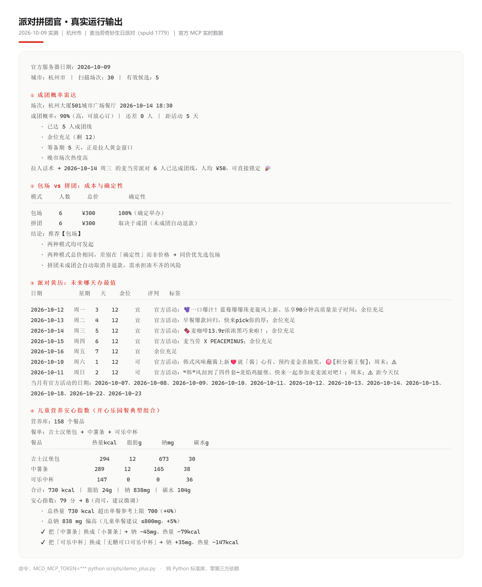
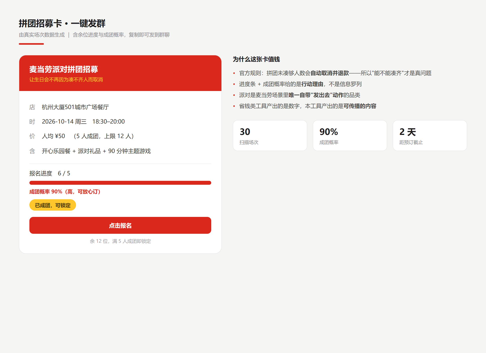
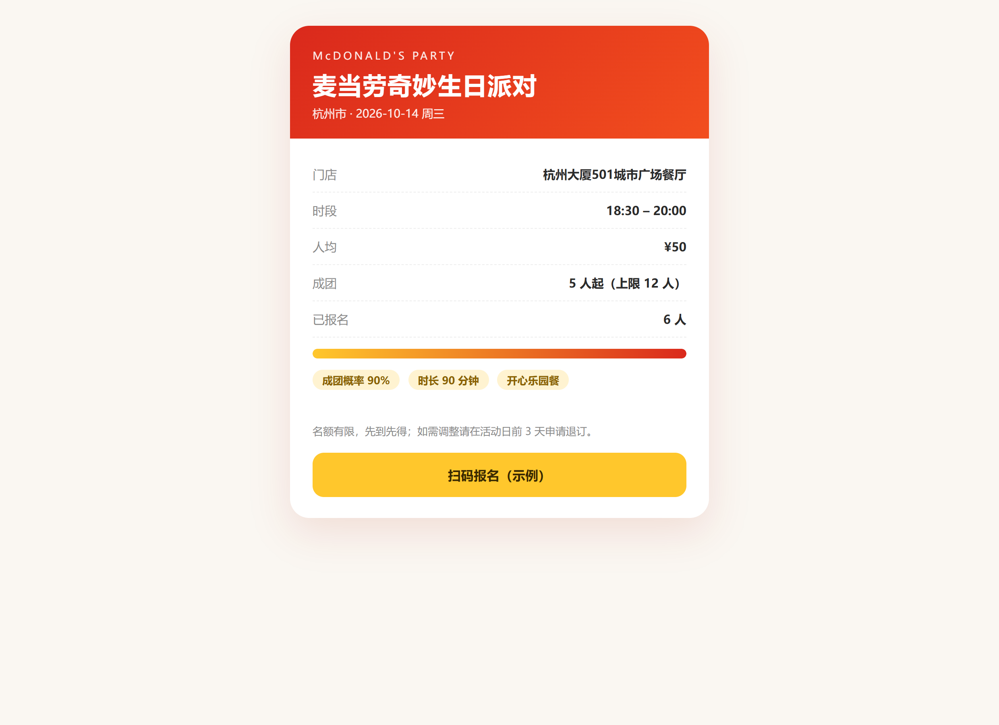

# 派对拼团官 · mcd-party-officer

> 麦当劳门店派对最怕的不是贵，是**凑不齐人**——官方规则写明：拼团未在截止前凑够人数会**自动取消并退款**。
> 本项目把派对从「怎么策划」推进到「**到底办不办得成**」：算成团概率、比包场与拼团、挑最值的日子、一键生成招募卡把人群拉满，并给出预订截止倒计时。

**别人帮你策划一场派对；我们帮你把人凑齐、把场锁定、把日子挑对、把人喊来。**

| 纯 Python 标准库 | 麦当劳官方 MCP | 全链路真实跑通 | 零第三方依赖 |
|:--:|:--:|:--:|:--:|
| 3.7+ 即可运行 | `mcp.mcd.cn` | 真实场次 / 余位 / 满减 | 无 pip install |



---

## 30 秒看懂：它和别的派对 Skill 差在哪

派对赛道已有两类做法，都很不错，但都**停在下单之前**：

| 做法 | 代表 | 它回答的问题 | 停在 |
|---|---|---|---|
| **策划案生成** | 多角色协作输出主题、流程、预算 | "怎么办好这场派对" | 方案交付即结束 |
| **活动地图 / 雷达** | 把门店与可约场次可视化 | "哪里有能办的场次" | 展示即结束 |
| **本项目** | 成团调度与撮合 | **"这场办得成吗、人怎么凑齐"** | 一直管到**锁场 + 拉人** |

差异不在功能多少，而在**是否回答了那个真正会导致派对泡汤的问题**：

| 维度 | 策划 / 地图类 | 本项目 |
|---|---|---|
| 核心问题 | 怎么办好、哪里有 | **办得成吗、人怎么凑齐** |
| 输出性质 | 文档 / 列表 | **可复现的概率与成本数字** |
| 风险量化 | 无 | **成团概率、包场 vs 拼团的确定性差异** |
| 传播环节 | 无 | **招募卡 + 邀请函，复制即可发群** |
| 时间管理 | 无 | **T-7 → T 筹备时间线 + 预订截止倒计时** |

「未成团自动退款」这条规则，只有先发现它，才会意识到真问题是**凑人**而不是**策划**——这就是本项目的立足点。

## 两个能直接发出去的产出物

工具产出数字容易，产出**能传播的内容**难。派对是麦当劳场景里唯一自带"发出去"动作的品类：





> 邀请函为单文件 HTML，麦当劳红黄配色，可直接分享；上图为真实渲染结果。
> 招募卡为纯文本，复制即可粘贴到任意群聊。

---

## 一、痛点：派对最容易死在"凑不齐人"

麦当劳门店派对的官方规则里有两条硬约束，它们决定了这个场景真正的难点：

| 规则 | 后果 |
|---|---|
| 拼团若未在截止前凑够人数，**预约自动取消并退款** | 选错场次 = 白折腾，生日当天没场地 |
| **需提前 3 天预订** | 留给"拉人"的窗口是有限的倒计时 |

于是用户在真实场景里会连续撞上四个问题：

1. **哪家店、哪天、哪一场，我最可能凑满人？** —— 余位和成团区间全在门店端，没法自助比价
2. **包场还是拼团？** —— 两种模式价格与风险不同，没人会算
3. **未来哪天办最值？** —— 官方营销活动日历是公开的，但没人拿它做决策
4. **怎么快速把人凑齐？** —— 发群、催人、统计，全靠人肉

## 二、本项目解决什么

### 四个决策

| 能力 | 说明 | 用户怎么问 |
|---|---|---|
| **成团概率雷达** | 把"未成团自动退款"的风险变成一个**可读的百分比**，并给出还差几人、拉人话术 | "6 个人能办成吗" |
| **包场 vs 拼团对比** | 两种模式的总价、举办确定性、推荐结论，找出人数临界点 | "包场还是拼团划算" |
| **派对黄历** | 官方营销活动日历 × 场次余位 × 提前量 → 未来哪天办最值（宜/可/忌） | "最近哪天办合适" |
| **儿童营养安心指数** | 对派对餐单做热量/钠/脂肪多约束评分，并自动给出替换建议 | "这套搭配孩子吃健康吗" |

### 三个产出物

| 产出 | 用途 |
|---|---|
| **拼团招募卡** | 带余位进度条与成团概率的群消息文本，复制即可发 |
| **派对邀请函** | 麦当劳红黄配色的单文件 HTML，可直接分享 |
| **筹备时间线** | T-7 → T 日待办清单 + 预订截止倒计时 |

### 一个扫描视图

**五维成团调度评分**：成团可行性（硬约束）→ 余位紧张度 → 时段匹配 → 价格 → 距离，输出三个视图：**推荐 Top N / 最易成团 / 余位告急**，以及一屏四宫格（最优综合 / 最省人均 / 最近门店 / 空位最多）。

## 三、快速开始

### 1. 获取 MCP Token

访问 <https://open.mcd.cn/mcp>，手机号登录 → 控制台 → 激活 → 复制 Token（免费）。

> 每个 Token 每分钟最多 600 次请求，Token 请勿写入代码或提交到仓库。

### 2. 配置 MCP（可选）

若在支持 MCP 的客户端里使用，参考 `mcp-config.example.json`（脱敏示例，仅含环境变量占位符）。

### 3. 运行

```bash
export MCD_MCP_TOKEN=<你的 MCP Token>      # Windows: set MCD_MCP_TOKEN=...

python scripts/demo.py          # 基础演示：成团调度扫描
python scripts/demo_plus.py     # 完整演示：八大能力全量
```

零第三方依赖，仅使用 Python 标准库（3.7+）。

## 四、使用示例

### 对话式（在 WorkBuddy / Claude Code 等客户端中）

```
用户：帮我给 6 岁的女儿办一场麦当劳生日会，杭州，6 个人，预算每人 60，想晚上办

派对拼团官：
【商品与规则】麦当劳奇妙生日派对 · 人均 ¥50 · 5~12 人成团 · 需提前 3 天预订 · 面向 4-12 岁
【推荐场次】
门店                  日期          时段    人均   余位   成团概率   理由
杭州大厦501城市广场    2026-10-14   18:30   ¥50    12     90%       已达 5 人成团线 / 晚市热度高 / 筹备期 5 天
...
【决策建议】推荐包场（与拼团同价，但 100% 确定举办）；最佳日期 10-14（当天有官方活动）
【提醒】预订截止 10-11，仅剩 2 天
【可复制产出】<拼团招募卡文本>
```

### 代码式

```python
from scripts.party_officer import plan
from scripts.party_plus import formation_radar, compare_modes, kids_nutrition_audit

res   = plan("杭州市", 1779, headcount=6, budget=60, prefer_time="dinner")
top   = res["best"][0]
radar = formation_radar(top["date"], top["sess"], 6)     # 成团概率 90%
modes = compare_modes(top["sess"], 6)                    # 包场 vs 拼团
audit = kids_nutrition_audit(cli, ["吉士汉堡包", "中薯条", "可乐中杯"])
```

### 真实运行输出（2026-10-09 实测）

```
① 成团概率雷达
场次：杭州大厦501城市广场餐厅 2026-10-14 18:30
成团概率：90%（高，可放心订）｜ 还差 0 人 ｜ 距活动 5 天

② 包场 vs 拼团
包场 6 人 ¥300  100%（确定举办）
拼团 6 人 ¥300  取决于成团（未成团自动退款）
结论：推荐【包场】

④ 儿童营养安心指数
吉士汉堡包 + 中薯条 + 可乐中杯 = 730 kcal / 脂肪 24g / 钠 838mg
安心指数：79 分 → B（尚可，建议微调）
  把「中薯条」换成「小薯条」→ 钠 -45mg、热量 -79kcal
```

## 五、能力清单

| # | 能力 | 入口 |
|---|---|---|
| 1 | 成团调度扫描 | `party_officer.plan` |
| 2 | 成团概率雷达 | `party_plus.formation_radar` |
| 3 | 包场 vs 拼团对比 | `party_plus.compare_modes` |
| 4 | 派对黄历 | `party_plus.party_almanac` |
| 5 | 儿童营养安心指数 | `party_plus.kids_nutrition_audit` |
| 6 | 筹备时间线 | `party_plus.party_timeline` |
| 7 | 招募卡 / 邀请函 | `party_plus.render_recruit_card` / `render_invite_html` |
| 8 | 四宫格比选 | `party_plus.scout_grid` |

算法细节与阈值见 [`references/creative_modules.md`](references/creative_modules.md)。

## 六、目录结构

```
mcd-party-officer/
├── SKILL.md                          # 技能主文件（Agent 运行时加载）
├── README.md                         # 本文件
├── CONTEST_DECLARATION.md            # 参赛声明（官方原文，未改动）
├── MCP_INTEGRATION.md                # MCP 接入说明
├── mcp-config.example.json           # 脱敏配置示例
├── workbuddy.md                      # WorkBuddy 开发对话上下文
├── docs/                             # README 预览图
├── examples/sample_invite.html       # 邀请函产物示例
├── scripts/
│   ├── mcd_client.py                 # MCP 通用客户端（仅标准库）
│   ├── party_officer.py              # 扫描 + 五维成团调度评分
│   ├── party_plus.py                 # 七个创意增强模块
│   ├── demo.py                       # 基础演示
│   └── demo_plus.py                  # 完整演示
└── references/
    ├── party_flow.md                 # 业务链路与字段字典
    ├── tools.md                      # 全量工具速查 + 响应格式陷阱
    └── creative_modules.md           # 创意模块算法说明
```

## 七、目标用户

- **有孩子的家庭**：想办生日会，但不清楚哪家店能办、哪场最容易凑满人
- **公司行政 / 团建组织者**：需要在小预算下组织团体派对
- **朋友聚会组局人**：需要快速招募、统计人数、把场锁定
- **门店端运营**：可用于观察余位分布与成团难度

## 八、隐私与安全

- **Token 只从环境变量读取**，不写入代码、不提交仓库（`mcp-config.example.json` 仅含占位符）
- 全流程**只读优先**：除下单接口 `party-order-create` 外均为只读调用；下单必须经用户二次确认
- 不在日志或输出中展示任何个人凭证信息
- 项目输出仅供参考，不构成医疗、营养或其他专业建议；餐品信息、价格与供应状态以麦当劳官方渠道实时结果为准

## 九、参赛信息

- 参赛活动：麦当劳程序员创意开发大赛（1024 程序员节）
- 开发工具：腾讯 WorkBuddy
- 参赛声明：[`CONTEST_DECLARATION.md`](CONTEST_DECLARATION.md)
- 本项目为参赛作品，由参赛者独立开发，非麦当劳官方产品

---

© 2026 · 本项目为麦当劳程序员创意开发大赛参赛作品
